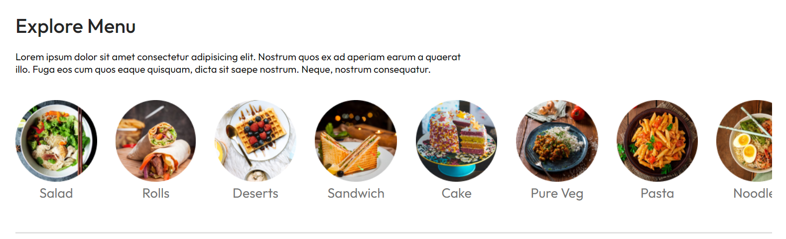

# 🍅 Tomato - Full-Stack Food Restaurant Service

Welcome to **Tomato**, a comprehensive food restaurant service developed using the MERN stack (MongoDB, Express.js, React.js, Node.js). This application provides seamless functionality for customers to browse the menu,sort the menu based on the category, add food to the cart, place orders, and much more. It also features a separate admin portal for managing food items, processing orders, and other essential administrative tasks.




## 🚀 Features

### Customer Portal
- **Browse Menu:** View a wide range of food items available.
- **Add to Cart:** Add your favorite food items to the shopping cart.
- **Remove from Cart:** Easily remove items from the cart before placing an order.
- **Order Food:** Complete the order process and get your favorite food delivered.
- **User Authentication:** Secure sign-up and login functionality to manage orders and preferences.

### Admin Portal
- **Add/Update Food Items:** Add new food items or update existing ones with ease.
- **Remove Food Items:** Remove outdated or unavailable items from the menu.
- **Process Orders:** View and manage customer orders, update order statuses, and track order progress.
- **Dashboard:** Access a comprehensive dashboard displaying key metrics and reports.
- **Details:** Get all the Details about users and their orders.

## 🛠️ Technology Stack

- **Frontend:** HTML, CSS, React.js, Context API for state management, Axios for HTTP requests,Toast for notifications.
- **Backend:** Node.js, Express.js for API creation, JWT for authentication, and Bcrypt for password hashing.
- **Database:** MongoDB and Mongoose for data storage and management.
- **Authentication:** JSON Web Tokens (JWT) for secure authentication and authorization.

## 📦 Installation

1. **Clone the Repository:**
   ```bash
   git clone 

2. **Install Dependencies:**
- **Navigate to the root directory and run:**
  ```bash
  npm install
- **Navigate to the client directory and run**
  ```bash
  npm install

3. **Set Up Environment Variables:**
- **Create a .env file in the root directory and add the following**
  ```bash
  MONGO_URI=your_mongo_db_connection_string
  JWT_SECRET=your_jwt_secret

4. **Run the Application:**
- **For the backend, run:**
  ```bash
  npm run server

- **For the frontend, navigate to the frontend directory and run:**
  ```bash
  npm run dev

- **For the admin page, navigate to the admin directory and run:**
  ```bash
  npm run dev


## 🛡️ Security
- Passwords are securely hashed using Bcrypt.
- JWT is used for secure authentication and authorization.
- All sensitive data is stored securely in environment variables.

## 🛠️ Maintenance
- Regularly update dependencies to keep the application secure.
- Monitor server and database performance to ensure a smooth user experience.
- Review and address any reported issues or bugs promptly.

<hr>

## 🤝 Contributing
Contributions are welcome! Please fork this repository and submit a pull request for any enhancements or bug fixes.


<hr>

Enjoy the seamless experience of managing your restaurant with Tomato! Bon appétit! 🍽️